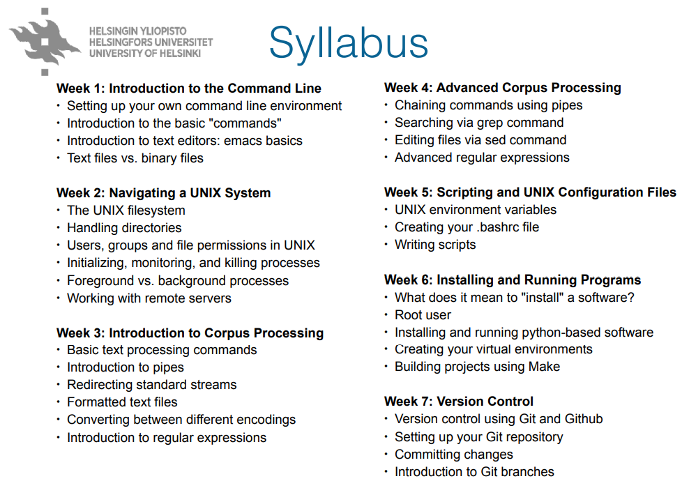

## Command-line Tools for Linguists

This document is a description of what I have learned during the Command-line Tools for Linguists 2022. The course was organised by University of Helsinki as a web course. It is a course designed for students interested in command-line tools that can be used for example in language text file processsing. The course covered the following topics:



## Week 1 Introduction to Command Line Environments

The first week was an introduction to command-line environments. The first task was to install [Windows Subsystem for Linux (WSL)](https://ubuntu.com/wsl) for your own computer. This was an easy task for me since I had just done the same thing when I started at my new project at work.

The course material provided introduction on the commands used for listing the contents of your current directory, changing your current directory, downloading content from the internet, displaying a text file using less, creating and removing files and directories,
copying, renaming and moving files, as well as opening and editing a file in text editor called emacs. Most of these commands, as well as different commands for quitting applications were familiar to me due to my previous studies in Computer Science, and I use them daily at my work.

However, I had not previously used the command for downloading content, even though it is a very simple command. Thus, I learned how to fetch books from [gutenberg.org](https://www.gutenberg.org/) using wget. For example, the following command fetches book "Don Quijote" in plain text format:

```
wget https://www.gutenberg.org/files/2000/2000-0.txt
```

## Week 2 Navigationg a UNIX System

The second week deepened understanding about the UNIX system as well as on working on a remote server using the programs ssh and scp. Again I was familiar with most of the commands used in UNIX for copying, moving and deleting files and folders, or how to visit the root of the system, or change the read and write permissions of a file. However, this week I learned how to compress a folder directory into compressed.tgz package using tar:

```
tar -czvf compressed.tgz my_folder
```

I also learned how to find the PID of a process and how to kill it, as well as how to run commands in the background.

```
ps aux               // list all processes
kill -9 process_id   // kill a certain process by giving the id
```

In addition, I learned how to form a remote connection to Puhti server and how to copy files to and from a server using scp.

```
from local to remote home dir:
scp  my_folder/life_of_bee.txt puhti:~

bring a copy from remote to local:
scp puhti:~/life_of_bee.txt .
```

## Week 3 Basic Corpus Processing

This week was probably the most interesting, as I learned how to process corpus files with command line tools. For example, you can count the number of lines, words and characters in a text file with _wc_ command. Some file utilities that I learned are explained in the following table.

| Command    | Usage |
| -----------|:----------|
| cat -s     | concatenate files to the standard output |
| comm -3    | compare two sorted files, line by line |
| cut -s     | remove section from file |
| diff -q    | file compare, line by line |
| head -n    | output the first part of files |
| join -i    | join lines of two files on a common field |
| more, less | view file content, one page at a time |
| sort -n    | sort lines in text file |
| split -l   | split file into pieces |
| tail -f    | output last part of the file |
| tr -d      | translate or delete character |
| uniq -c -u | report or omit repeated lines |
| wc -w      | print newline, word, and byte counts for each file |

I also re-learned the differences between the ASCII, Latin-1 and utf-8 encoding systems, although I had studies about them during my Computer Science studies. You can convert Latin-1 encoded text into utf-8 by

```
iconv -f latin1 -t utf- file.txt > file.utf8.txt
```

You can also convert between Windows and UNIX text file formats with two convenient commands dos2unix and unix2dos. Examples:

```
dos2unix mywindowsfile.txt

unix2dos myunixfile.txt
```

## Week 4 Advanced Corpus Processing

This week continued where week 3 material was left off. I learned how to make frequency lists from a text file, and pipe UNIX commands using "the pipe" character. I also learned how to generate sentence per line format from a text file. Probably the most difficult thing learned on this course was how to transform a text file into a list of word n-grams. For example, the following command lists words from a book text file to a frequency order, with most frequent on top:

```
cat book.txt | tr -s '\n\r\t ' '\n' | tr -dc "A-Za-z0-9\n'" | sort | uniq -c | sort -nr | less > lista.txt
```

In addition to these, I learned how to use the _sed_ command, which is used for deleting lines, finding patters or replacing patterns in a text file. The most common usage of sed is apparently to substitute patterns with new strings, but the find option is also very useful in testing if your pattern works as it should be. For example, you can remove empty lines from the file and redirect to new file:

```
sed '/^$/d' book.txt > book_noemptylines.txt
```

## Week 5 Scripting and Configuration Files

On the fifth week I learned the basics of scripting. I had run -sh scripts at work, but I had not written them by myself, so it was fun to learn how to write a .sh script from scratch. I learned how to write simple scripts and how to access command line parameters in scripts. I also learned how to implement if statement in the script and how to use command substitution. This week was probably the hardest one on the course, since there were a lot of material to go through in terms of scripting tutorial.

Also, the modification of .bashrc / .bash_profile turned out to be very handy especially with aliases. The modified profile can be taken into use with command

```
source ~/.bashrc
```

## Week 6 Installing and Running Programs

This week covered topics related to installing and running programs. I have used pip, apt and brew before at work as test automation engineer, so I was familiar with what you can do with them. However, I had not used make before, so it was all new to me. Make is used for building other programs, libraries or other projects like corpus collections. In this course I learned to write a Makefile and run it for the first time ever. It was fun to browse the GNU Make manual for learning how to use it, although it contained a whopping 230 pages!

Another tool that was new to me was called meld. It is a nicely visual diff tool, which shows the difference between files in color, and can compare more than two files or directories at the same time. You can install the tool as sudo user with apt by typing

```
sudo apt-get install meld
```

## Week 7 Version Control

The last week of this course was all about git version control program. As a test automation engineer, I use git daily at work to pull other developers' changes and to push my changes, so practically this week's material and quiz was just a good revise of all git commands. I also have been creating repositories for my hobby coding projects at GitHub, so everything that we were meant to study this week was rather easy for me.

## Final project - Building Web Pages using GitHub Pages

By doing the final project I learned how to
- set up a Ruby installation environment, solve problems during installation process and install Jekyll using it
- fork a public repository in GitHub
- write documents using markdown
- assess what I had learned during the course
- merge a development branch with master branch
- build and display my webpage using command
```
bundle exec jekyll serve
```

## In Conclusion

This course was one of the best and useful courses I have taken during the past ten years! I learned so much on this course. Even though I already knew how to use the basic command-line tools such as Windows PowerShell, Command Prompt or Git Bash, I also got to practise the skills acquired previously. Moreover, I learned the basic use of WSL (Ubuntu).

I also learned to form regular expressions at a basic level and how to use them to process text corpora with command-line tools. I learned how to run and install simple programs from the WSL, and I learned to write simple scripts. Finally, I learned to work on the server.

I can warmly recommend Command-line Tools for Linguists web course to anyone interested in processing language files with simple command-line tools. The course format was fantastic regarding students working full time. The course material was super good and the videos were really great and easy to follow.

# List of Interesting Links

- [Command-line for beginners](https://ubuntu.com/tutorials/command-line-for-beginners#1-overview)
- [Unix tutorial](https://people.ischool.berkeley.edu/~kevin/unix-tutorial/toc.html)
- [Project Gutenberg](https://www.gutenberg.org)
- [Tips for ssh and scp commands](https://acloudguru.com/blog/engineering/ssh-and-scp-howto-tips-tricks)
- [chmod command](https://www.tutorialspoint.com/unix_commands/chmod.htm)
- [Unix/Linux process management](https://www.tutorialspoint.com/unix/unix-processes.htm)
- [Compressing directories and files in Unix](https://help.dreamhost.com/hc/en-us/articles/360002747432-UNIX-commands-Compressing-directories-and-files)
- [Command line tricks for data scientists](https://medium.com/@kadek/command-line-tricks-for-data-scientists-c98e0abe5da)
- [Bash Scripting Tutorial - 1. What is a Bash Script?](https://ryanstutorials.net/bash-scripting-tutorial/bash-script.php)
- [Bash Scripting Tutorial - 2. Variables](https://ryanstutorials.net/bash-scripting-tutorial/bash-variables.php)
- [What is a Makefile and how does it work?](https://opensource.com/article/18/8/what-how-makefile)
- [GNU Make manual](https://www.gnu.org/software/make/manual/make.pdf)
- [Markdown Cheat Sheet](https://github.com/adam-p/markdown-here/wiki/Markdown-Cheatsheet)