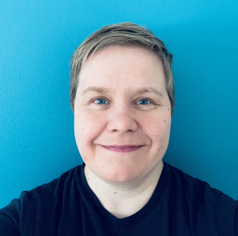

## Introduction

 I am Teija Alasalmi, Test Automation Engineer and Portuguese major student at the University of Helsinki. I hold two Master's degrees in Computer Science and English, and a Bachelor's degree in Business Information Technology (Front End Programming). 

My passions include anything related to test automation as well as Spanish or Portuguese language. I play rugby as a hobby and train karate for becoming a black belt someday.

## Find me on

[LinkedIn](https://www.linkedin.com/in/teija-alasalmi/), [GitHub](https://github.com/teijatestaaja)

## Contact

My email address is teija.alasalmi@helsinki.fi 

## CV

See my CV in [pdf](/assets/documents/cv_2022_Teija.pdf)

## Courses I Have Taken

[Portuguese 1A](https://studies.helsinki.fi/opintotarjonta/cu/hy-CU-134767408-2021-08-01/KIK-PO111/Portugali_1A), autumn 2022.

[Portugal’s history and culture](https://studies.helsinki.fi/courses/cur/hy-opt-cur-2223-67c3615c-6fec-4714-8025-f3fffb215813/KIK-PO112/Portugalin_historia_ja_kulttuuri_Lectures), autumn 2022.

[Command-line Tools for Linguists](https://studies.helsinki.fi/courses/cu/hy-CU-134651633-2021-08-01), autumn 2022.

## Projects

[Command-line course](cmdline_course.md) - Learnings from the course I took during autumn 2022.

[Basics of Kotlin](https://teijatestaaja.github.io/kotlin-peruskurssi/) - A web course designed by me as part of my Bachelor's Thesis at Haaga-Helia University of Applied Sciences.

## Miscellaneous 

Gotta love [test automation](https://robotframework.org/), [rugby](https://www.clubee.com/helsinkirc/page/naiset-107362) and [karate](https://jukara.fi/karate/), especially [Shotokan karate](https://seitokai.eu/).